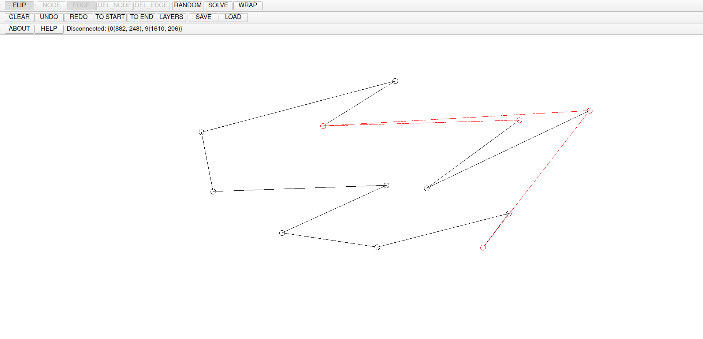

# FlipGraph

## Introduction

This program is part of my bachelor thesis:
"Analysis of flip graphs of non-crossing
spanning paths of general point set"

## General Information



This software supports:
- Planar path drawing
- Simple edge manipulation
- Solver and Wrapper as described in the thesis

## User Guide

## Button usage (From left to right, from up to down)

### First Row

**FLIP**: Switch between EDIT and FLIP mode. \
(Modes can only be switched if the graph is a non crossing spanning path)

**NODE**: Adds a node and/or extend the path from an endpoint

**EDGE**: Click on one node and then another, and an edge will be added. \
(Click on two already connected nodes does not work)

**DEL_NODE**: Deletes a node.

**DEL_EDGE**: Click on one node and then another, and an edge will be deleted (if exists).

**RANDOM**: Generate a random planar path on the same node set.

**SOLVE**: Reconfigure the existing path to a canonical path (as defined in the thesis).

**WRAP**: Reconfigure the existing canonical path to a wrapping path (as defined in th thesis).

**Note:** Buttons in the first row is separated in EDIT and FLIP mode. \
Available in **EDIT** mode: NODE, EDGE, DEL_EDGE, DEL_EDGE \
Available in **FLIP** mode: RANDOM, SOLVE, WRAP

### Second Row

**CLEAR**: Clear the entire screen.

**UNDO**: Undo the last change.

**REDO**: Redo the last undo.

**TO_START**: Undo all changes.

**TO_END**: Redo all changes.

**LAYERS**: Show the layers of convex hulls. \
(To stop it from showing, simply click on the screen once)

**SAVE**: Save the current graph (in a .grph file).

**LOAD**: Load a graph from a .grph file.

### Third Row

**ABOUT**: Load the about page.

**HELP**: Load the help page that briefly explains the buttons' usage.

## Additional functionalities:
**Automatic planarity detection**: \
If a graph is not a planar path (i.e. non crossing and spanning), the program will check how the path can be fixed based on edge difference and suggest all solutions possible.

**Simple edge operation**: \
An edge can be deleted simply by right-clicking on an edge. Any edge (that can be added) suggested by the planarity detection can be added by simply left-clicking on the dotted line (as shown in the above image). (only available in FLIP mode)


## Running the program

Minimal requirement: Python 3.10 or later

1. Install the packages with:
```
pip install -r requirements.txt
```

2. Run the program using python with:
```
python main.py
```

## Troubleshooting

**Frozen whiteboard**: \
In this case, SAVE the graph, relaunch the program and LOAD the saved graph again will work.


## TODOs

- [X] Basic drawing functionalities
- [X] Basic graph theory functionalities
    - [X] Flip function
    - [X] Update Accessability
    - [X] Cross detection between edges
- [X] Right click to delete edge
- [X] Right click to add edge
- [X] Error detection
    - [X] Spanning path
    - [X] Cross detection
    - [X] Edge deletion/addition hint
- [X] Algorithm for constructing spines/convex hulls
- [X] Save & Load
- [X] Undo/Redo
- [X] Path randomizer on same point set
- [X] Solver for paths (converting given path to a canonical path)
- [ ] (TBA?)